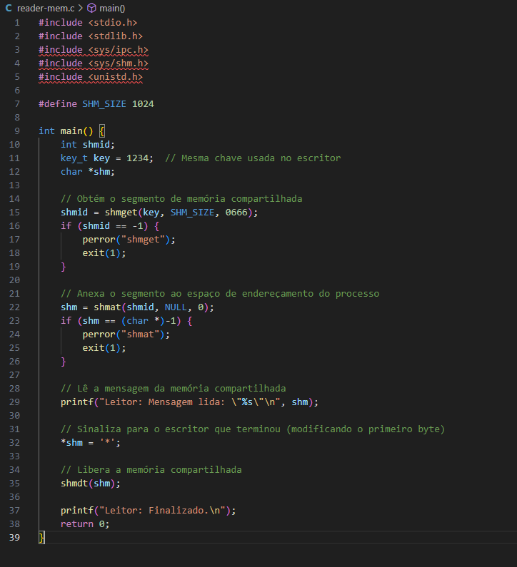
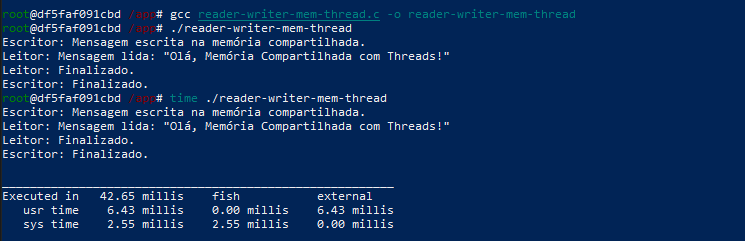

# S.O. 2025.1 - Atividade 05 - Prática de comunicação de tarefas
## Aluna: Emanuelly Karine Fernandes dos Santos
## Data: 13/06/2025

# Objetivo do exercício

O principal objetivo da prática é compreender e aplicar diferentes formas de comunicação entre tarefas (processos e threads) em sistemas operacionais, explorando mecanismos de troca de informações como: Arquivos, Memória compartilhada e Threads.

# Passos Executados
## 1. Comunicação com arquivos

- Iniciei utilizando a mesma pasta da prática anterior e criando dois arquivos principais o writer-file.c e o reader-file.c para fazer a troca de informações de arquivos.
- O funcionamento é da seguinte forma: o escritor (writer-file) cria o arquivo comunicacao.txt, escreve uma mensagem e espera a leitura.
- O leitor lê a mensagem, renomeia o arquivo para comunicacao.lida, sinalizando a finalização.
- O escritor detecta a mudança e encerra.

- Código do arquivo writer-file

- Código do arquivo reader-file.

- Compilei e executei os dois códigos em terminais diferentes para simular a comunicação

- Após a execução do reader-file o writer file interpreta que o leitor foi finalizado e finaliza também.

## 2. Comunicação com memória compartilhada
- Iniciei criando os dois arquivos principais o writer-mem.c e o reader-mem.c.
- O funcionamento é da seguinte forma: writer-mem.c: Cria uma área de memória compartilhada e escreve uma mensagem e o reader-mem.c: Lê a mensagem e sinaliza com um caractere.

- Código do arquivo writer-mem.

- Código do arquivo reader-mem.

- Iniciei o docker fedora em dois terminais powershell diferentes

- Compilei e executei os dois códigos em terminais diferentes para simular a comunicação.

## 3. Comunicação com threads
- Criei um arquivo chamado reader-writer-mem-thread que simularia a comunicação de memória utilizando threads e compilei e executei para ver seu tempo de execução.

- Criei um arquivo chamado reader-writer-thread que simularia a comunicação de arquivos utilizando threads e compilei e executei.

- Tempo de execução do código acima.

- Tempo de execução do writer e reader de memória sem thread.

  
## 4. Comparação de tempos de execução
 O tempo obtido com processos é inferior ao código feito com threads já que nesse (com threads) os códigos são rodados simultaneamente. Porém o writer-mem e o reader-mem são ideais quando deseja executar de forma separada. A comunicação com processos é mais lenta enquanto a de threads é instântanea. 
